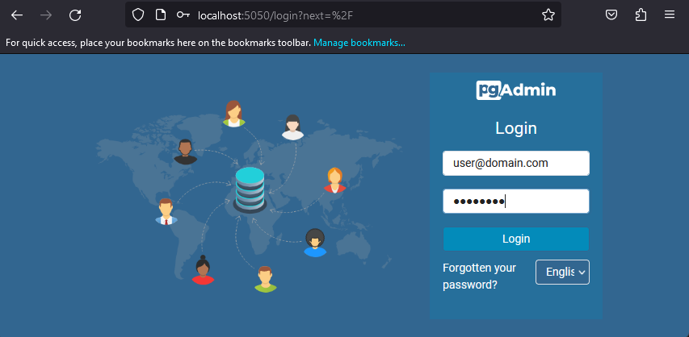
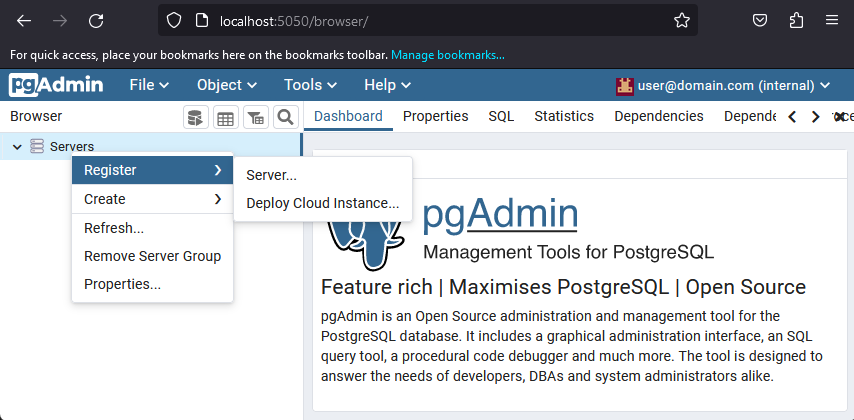
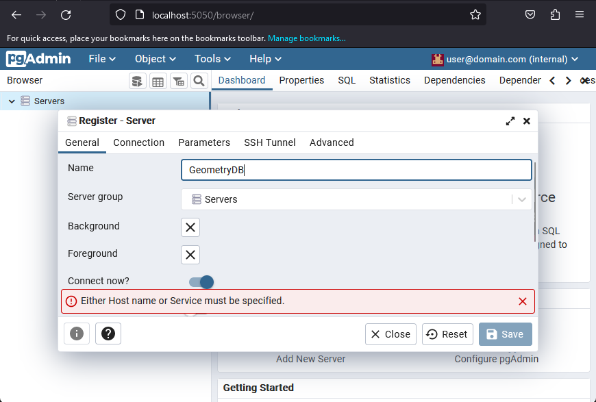
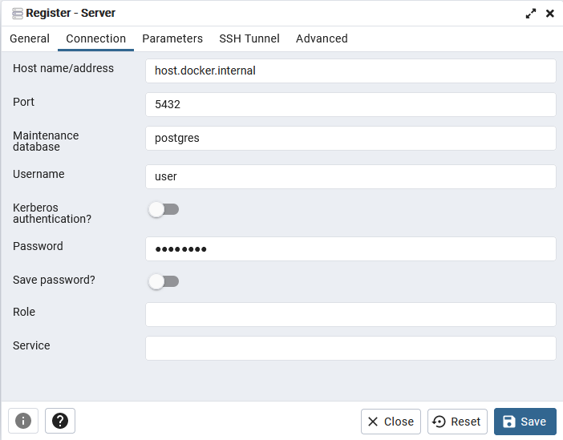
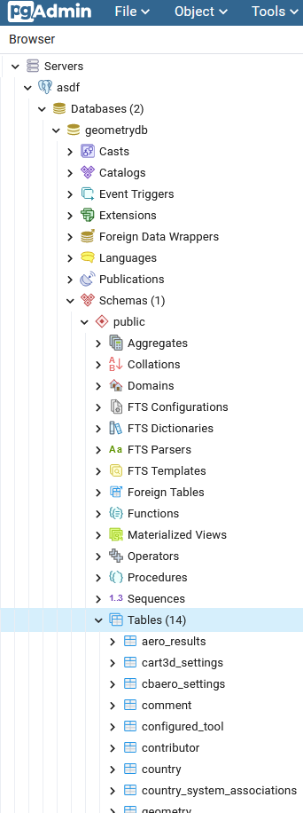

# HyperHub GeometryDB

## Introduction
GeometryDB stores the relationships between geometries, targets, meshes, tools, and aero results produced with those 
tools.

## Running
GeometryDB is a postgres database. Users can build the database by running docker from the `geometrydb` using the 
command shown below (with replacements for the placeholders):

```
docker build -t hyperhub/geometrydb:latest --build-arg dbname=<dbname> --build-arg dbuser=<dbuser> --build-arg dbpassword=<password> .
```

The build command above includes placeholder in `<>`:
  * `<dbname>`: The name of the database in which to place the geometry tables
  * `<dbuser>`: The name of the database user with access to the geometry tables
  * `<dbpassword>`: The password of the database user with access to the geometry tables

For example, one could build the database with:

```
docker build -t hyperhub/geometrydb:latest --build-arg dbname=hyperhub --build-arg dbuser=me --build-arg dbpassword=password .
```

In this case, the database will be called `geometrydb`, the username will be `user`, and the password will be `password`.

After building the container, users can run the container with:

```
docker run -e POSTGRES_PASSWORD=password -p 5432:5432 -d hyperhub/geometrydb:latest
```

Note that the argument to `POSTGRES_PASSWORD` will make the password for the admin `postgres` user `password`.

## Connecting to GeometryDB

### PgAdmin Container
Developers or admins can connect to GeometryDB using pgadmin. Pgadmin is most easilly used with docker. Users can run it
as shown below:

```
docker run -p 5050:80 -e PGADMIN_DEFAULT_EMAIL=user@domain.com -e PGADMIN_DEFAULT_PASSWORD=password -it dpage/pgadmin4
```

Users can then open their browser and navigate to localhost:5050 where they can connect with the credentials 
`user@domain.com` and `password` as shown below



The user should connect to GeometryDB using by right clicking on Server and `Register` > `Server`. 



In the server registration screen, the user can enter any name they want for the GeometryDB server. We recommend 
`GeometryDB`.



On the connection tab, the user must enter the GeometryDB host, username, and password. The host can be 
counter-intuitive when running pgadmin from a docker container. This is because, it's running *inside* the container. 
GeometryDB is running on the host machine at port 5432, but pgadmin's localhost is the pgadmin *container's*, localhost.
Docker assigns the host machine's IP address within containers to `host.docker.internal`.



After saving the connection one should see the `GeometryDB` and its tables in the `public` schema as shown below:


